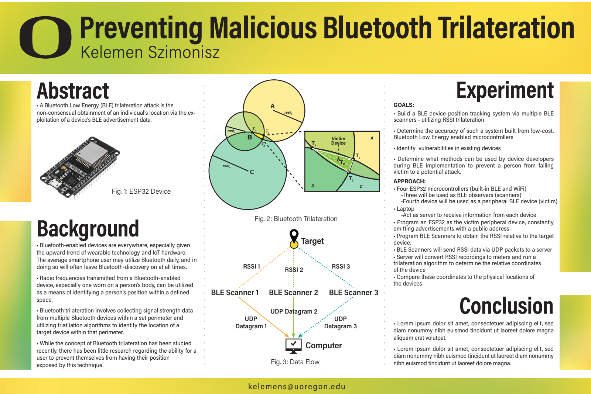

# ble-position-tracking



### BLE Scanners: 
Flash three ESP32's with ESP32_BLE_Scanner_Targeted_WiFi.ino 

### BLE Advertiser: 
Flash one ESP32 with ESP32_BLE_Advertisement_Scanner.ino

### UDP Server and Trilateration Program:
```
make
./bin/trilateration-server
```
